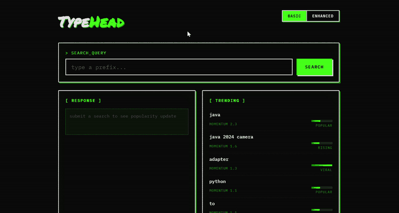

# TypeHead

A search typeahead system that suggests popular queries as you type, records searches, and ranks results by popularity and recency. Built as a backend data-system exercise: fast reads, distributed caching, batched writes, and trending search support.



## What it does

Type a prefix in the search box and the app returns up to 10 matching suggestions ranked by popularity. Submit a search and the system records it, updates popularity scores, and feeds the trending panel. The UI shows popularity as heat bars and labels (viral, hot, popular, rising) rather than raw counts.

Behind the UI:

- **SQLite** stores query counts as the source of truth
- **In-memory trie** serves prefix lookups in O(prefix length) time
- **Distributed cache** with consistent hashing routes suggestion results across nodes
- **Batch writer** aggregates search submissions before writing to the database
- **Trending tracker** blends all-time popularity with recent activity in enhanced mode

## Quick start

No Docker required. Python 3.10+ is enough.

**Windows**

```bat
run.bat
```

**macOS / Linux**

```bash
chmod +x run.sh && ./run.sh
```

On first run this creates a virtual environment, installs dependencies, ingests the dataset, and starts the server at http://localhost:8000.

### Manual setup

```bash
python3 -m venv .venv

# Windows
.venv\Scripts\activate

# macOS / Linux
source .venv/bin/activate

pip install -r requirements.txt
python scripts/ingest_dataset.py
uvicorn app.main:app --port 8000
```

Open http://localhost:8000 for the UI. API documentation is at http://localhost:8000/docs.

### Run tests

```bash
python -m pytest -q
```

### Run benchmarks

Start the server, then in another terminal:

```bash
python scripts/benchmark.py
```

Results are written to `bench_results.json`.

## Dataset

**Source:** [Peter Norvig's count_1w.txt](https://norvig.com/ngrams/count_1w.txt)

333,333 English words with real corpus frequencies in tab-separated format (`word<TAB>count`). No authentication needed. The loader imports the top 200,000 entries by default, above the 100,000 query minimum.

```bash
python scripts/ingest_dataset.py                  # download and ingest
python scripts/ingest_dataset.py --limit 150000   # cap row count
python scripts/ingest_dataset.py --synthetic      # offline generated data
```

Re-running ingestion is additive: counts for existing queries are summed.

## API reference

| Method | Path | Description |
|--------|------|-------------|
| GET | `/suggest?q=<prefix>&mode=basic\|enhanced` | Up to 10 prefix matches. Basic sorts by all-time count. Enhanced adds recency. |
| POST | `/search` | Body: `{"query": "..."}`. Returns `{"message": "Searched", ...}` and records the query. |
| GET | `/trending?n=10` | Top queries by recent, decayed activity. |
| GET | `/cache/debug?prefix=<prefix>` | Shows which cache node owns the key and whether it is a hit or miss. |
| GET | `/cache/route?q=<prefix>` | Same routing info as `/cache/debug`. |
| POST | `/cache/nodes/{name}` | Add a cache node. Reports how many keys were remapped. |
| DELETE | `/cache/nodes/{name}` | Remove a cache node. Reports remapped keys. |
| POST | `/flush` | Force the batch writer to flush immediately. |
| GET | `/stats` | Counters for store, cache, batch writer, and trending. |
| GET | `/healthz` | Health check and indexed term count. |

### Examples

```bash
curl "localhost:8000/suggest?q=app"
curl "localhost:8000/suggest?q=se&mode=enhanced"
curl -X POST localhost:8000/search -H "content-type: application/json" -d "{\"query\":\"iphone\"}"
curl "localhost:8000/cache/debug?prefix=iphone"
```

**Input handling:** prefixes are trimmed, whitespace is collapsed, and text is lowercased. An empty prefix returns the globally most popular queries. An unknown prefix returns an empty list. A new query is inserted with a starting count of 1.

## Performance

Measured with `scripts/benchmark.py` against a 100k+ query dataset:

| Metric | Typical value |
|--------|---------------|
| `/suggest` p50 / p95 (warm cache) | ~5 / ~7 ms |
| Cache hit rate (warm) | ~99% |
| Batch write reduction | ~96% (2,000 searches to ~80 row writes) |
| Keys moved on node add | ~1/N of sample keys |

Latency varies by machine. The trie alone answers in microseconds at this scale; the cache mainly reduces repeated work under load and carries the consistent hashing layer.

See [ARCHITECTURE.md](ARCHITECTURE.md) for full design notes, trade-offs, and failure modes.

## Project structure

```
app/
  main.py              FastAPI routes and app lifespan
  service.py           Orchestrates trie, cache, batch writer, trending
  db.py                SQLite primary store
  trie.py              Prefix trie with cached top-K per node
  cache/
    consistent_hash.py Consistent-hash ring with virtual nodes
    node.py            Single cache node (LRU + TTL)
    cluster.py         Multi-node cache cluster
  batch_writer.py      Buffered, aggregated writes
  trending.py          Sliding-window recency scoring
  config.py            Tunables (overridable via environment)
scripts/
  ingest_dataset.py      Download or generate dataset, load into SQLite
  benchmark.py           Latency, cache hit rate, write reduction
static/                Web UI (search box, suggestions, trending)
tests/                 pytest suite
```

## Design summary

| Component | Approach |
|-----------|----------|
| Suggestions | Trie with cached top-K per node. No per-request sort. |
| Cache | Consistent hashing across 4 in-process nodes with LRU and TTL. |
| Writes | Searches buffered and flushed by size (100) or interval (2s). |
| Trending | Time buckets + exponential decay + anti-spike dampers. |
| Enhanced mode | `log10(count) + weight * recency_score` ranking formula. |

## Assignment coverage

| Requirement | Implementation |
|-------------|----------------|
| Prefix suggestions (top 10, count sorted) | `GET /suggest` with trie + cache |
| Search submission with count update | `POST /search` with batch writer |
| Distributed cache with consistent hashing | `app/cache/` cluster |
| Trending searches | `GET /trending` + enhanced suggest mode |
| Batch writes | `app/batch_writer.py` |
| Debug cache routing | `GET /cache/debug` |
| UI with debounce and keyboard navigation | `static/` |
| Performance reporting | `scripts/benchmark.py` |

## License

Built for an academic assignment. Dataset courtesy of Peter Norvig's word frequency list.
